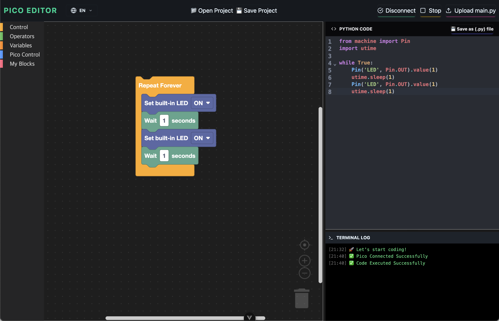

# Pico-Editor

Pico Editor - Both Block and Text based Coding Editor in Web/PC hybrid environment for Raspberry Pi Pico with Blockly and Python support.

## Screenshots


## Web-based Demo
[https://pico-editor.vercel.com](https://pico-editor.vercel.com)

## Project Dev Env Setup
### Get souce codes
```sh
git clone https://github.com/roboticsware/pico-editor
cd pico-editor
```

### Install Dependancies
```sh
npm install
```

### Compile and Hot-Reload for Development

```sh
npm run dev
```

### Type-Check, Compile and Minify for Production

```sh
npm run build
```

## Desktop Build (Electron)

This project supports multi-platform desktop versions using Electron and Capacitor.

### Build and Run Desktop App

```sh
# Build the web app and sync with electron
npm run electron:build

# Open the desktop app
npm run electron:open
```

### Create Desktop Installers

You can create installers for different platforms using the following commands:

#### macOS (DMG)
```sh
npm run electron:make:mac
```

#### Windows (NSIS xe64)
```sh
npm run electron:make:win
```

#### Linux (AppImage, deb)
```sh
npm run electron:make:linux
```

